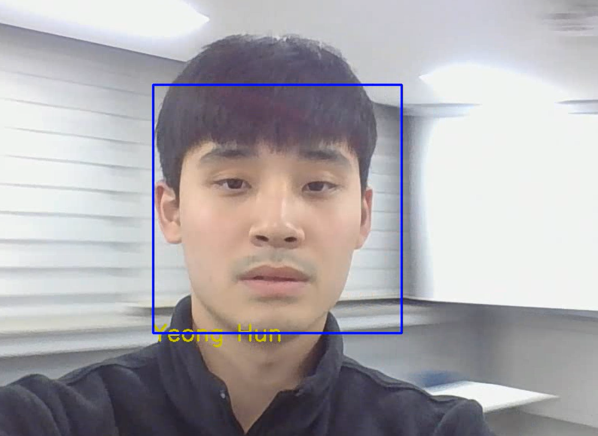

# 과제 계획서

## 제목: 얼굴 인식 출입 체계 시스템

팀장 : 이영훈 : 모델 개발 담당

팀원 : 이승구(데이터 수집 및 자료 조사), 민규동(GUI와 모델의 결합 담당)

---

## 브레인 스토밍

이영훈 - 얼굴 인식을 사용하기 쉽게 프로그램 화

민규동 - 사람 검출을 활용한 출석 수 카운트

이승구 - 얼굴 인식을 이용한 출석 체계

---

## 과제 요약

기존의 개발된 GUI가 존재하지만 머신 러닝 기반 모델인 관계로 정확도 이슈가 존재한다. 이를 해결하기 위해 자체적으로 ResNet을 SiameseNetwork 방식으로 구현한 딥러닝 모델을 개발하여 GUI의 모델을 교체한다.

---

## 일정 계획

* 11월 14일 ~ 12월 5일 모델 개발 
* 11월 20일 ~ 12월 5일 GUI 모델 교체 
* 12월 5일 ~ 12월 10일 보고서 작성

---

## 예상 결과

프로그램의 학습 모델을 딥러닝 으로 교체하여 보다 높은 정확성을 갖고 얼굴 인식을 하는 프로그램이 완성 될 것이다.

---

## 참고 문헌

ResNet 논문 

[1] K. He, X. Zhang, S. Ren and J. Sun, “Deep Residual Learning for Image Recognition”, *Proceedings of the IEEE Conference on Computer Vision and Pattern Recognition (CVPR)*, pp. 770,  2016.

SiameseNetwork 논문

[2] G. Koch, R. Zemel, and R. Salakhutdinov. “Siamese Neural Networks for One-shot Image Recognition”. ICML Deep Learning workshop, 2015.

CNN을 활용한 얼굴 인식에 관한 연구

[3] D. Y. Son and 이광근. “A Study on the Recognition of Face Based on CNN Algorithms" *인공지능연구*, vol. 5, no. 2, pp.17, 2017.

[4] 한영환. (2007). 얼굴 인식 시스템을 위한 얼굴의 특징 검출. 한국정보기술학회논문지, 5(2), 120-127.
